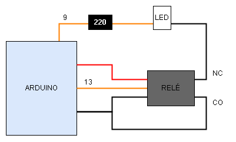

# LDR-ARDUINO

Este projeto utiliza um sensor fotoresistor (LDR) e verifica a luminosidade do ambiente para assim calcular a necessidade de ligar ou não uma lâmpada com um relé para melhor visualização.

